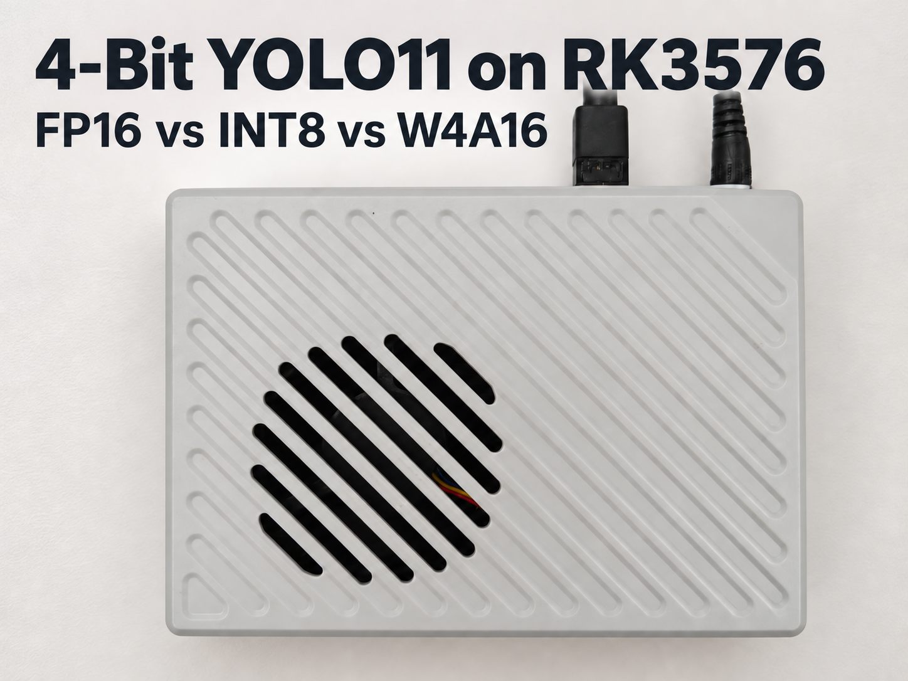
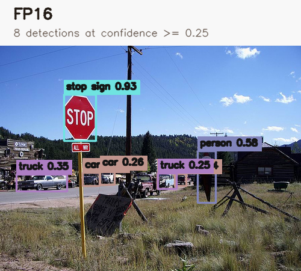
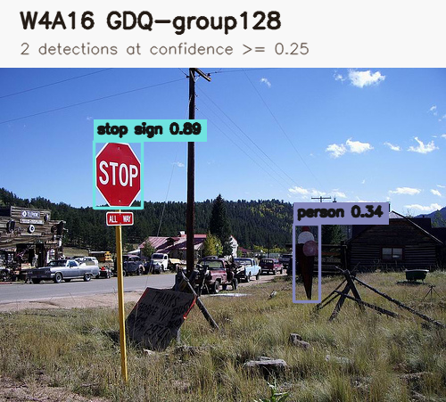

# YOLO11n Quantization Benchmark on Rockchip RK3576



This project converts one YOLO11n ONNX model to FP16, INT8/W8A8, and W4A16 RKNN models and benchmarks them on a reComputer RK3576 under a repeatable test protocol.

W4A16 means 4-bit weights and 16-bit activations. It is 4-bit **weight quantization**, not a fully W4A4 or “pure INT4” network.

## Results

| Precision | Model size | Mean latency | Throughput | Peak RSS | COCO AP50–95 |
| --- | ---: | ---: | ---: | ---: | ---: |
| FP16 | 9.38 MiB | 43.95 ms | 22.76 FPS | 222.03 MiB | 0.3999 |
| INT8/W8A8 | 6.93 MiB | 21.61 ms | 46.36 FPS | 202.02 MiB | 0.3917 |
| W4A16 GDQ-group128 | 4.39 MiB | 57.93 ms | 17.30 FPS | 219.27 MiB | 0.3583 |

INT8 delivered about 2.04 times the FP16 throughput while losing 0.82 AP points. W4A16 reduced the RKNN file to 46.8% of the FP16 size, but it was slower than both FP16 and INT8 in this YOLO11n test.

## Real inference outputs

The following outputs use the same COCO val2017 image, `000000222094.jpg`. The boxes come from predictions saved during the formal 1,000-image evaluation. Only detections with confidence at least 0.25 are shown; NMS is 0.65.

### FP16 — 8 detections



### INT8 — 8 detections


### W4A16 GDQ-group128 — 2 detections



This image was selected because the quantization difference is easy to see. The aggregate COCO AP results above remain the accuracy reference.

The unannotated source image is available at [`assets/coco-000000222094.jpg`](assets/coco-000000222094.jpg).

## Test environment

- Board: reComputer RK3576, 8 GB
- OS: Debian 12 / Armbian
- Kernel: `6.1.115-vendor-seeed-rk3576`
- RKNN-Toolkit2: 2.3.2
- RKNN-Toolkit-Lite2: 2.3.2
- RKNN Runtime: 2.3.0
- RKNPU driver: 0.9.8
- Input: 640 × 640 RGB
- Calibration: the same fixed 20 COCO val2017 images for INT8 and W4A16
- Accuracy: a fixed 1,000-image COCO val2017 subset, random seed 3576
- Performance: 50 warm-up iterations and 500 measured inferences, repeated three times with rotated model order

## Repository layout

```text
assets/                              Charts, cover, source image, inference outputs
data/                                Calibration list and deterministic COCO subset metadata
results/                             Conversion, performance, and accuracy summaries
scripts/convert_yolo11.py            ONNX-to-RKNN conversion
scripts/benchmark_rknn.py            RKNNLite latency and memory benchmark
scripts/evaluate_yolo11.py           YOLO11 decoding and COCO evaluation
scripts/prepare_coco_subset.py        Deterministic validation subset builder
scripts/render_prediction_comparison.py  Saved-prediction visualizer
scripts/run_formal_benchmark.sh       Repeated benchmark with controlled frequencies
scripts/run_w4_gdq_benchmark.sh       W4A16 GDQ-group128 benchmark
scripts/summarize_results.py          Result aggregation
```

Generated `.rknn` files and the full COCO image set are intentionally not committed.

## Install dependencies

Use the RKNN-Toolkit2 and RKNN-Toolkit-Lite2 wheels that match the target architecture and Python version.

```bash
python3 -m venv .venv
source .venv/bin/activate

python -m pip install \
  rknn-toolkit2==2.3.2 \
  rknn-toolkit-lite2==2.3.2 \
  numpy==1.26.4 onnx==1.16.1 \
  onnxruntime opencv-python pycocotools psutil
```

## Convert the models

Place the optimized Rockchip Model Zoo YOLO11n ONNX file at `models/yolo11n.onnx`.

### FP16

```bash
python scripts/convert_yolo11.py \
  --onnx models/yolo11n.onnx \
  --precision fp16 \
  --output models/yolo11n_fp16.rknn \
  --metadata results/convert_fp16.json
```

### INT8/W8A8

```bash
python scripts/convert_yolo11.py \
  --onnx models/yolo11n.onnx \
  --precision int8 \
  --dataset data/coco_subset_20.txt \
  --output models/yolo11n_int8.rknn \
  --metadata results/convert_int8.json
```

### W4A16 GDQ-group128

```bash
python scripts/convert_yolo11.py \
  --onnx models/yolo11n.onnx \
  --precision w4a16 \
  --dataset data/coco_subset_20.txt \
  --algorithm gdq \
  --method group128 \
  --output models/yolo11n_w4a16_gdq_group128.rknn \
  --metadata results/convert_w4a16_gdq_group128.json
```

The basic `normal + channel` W4A16 configuration compiled and ran, but scored only 0.0121 AP50–95. GDQ-group128 recovered AP50–95 to 0.3583. Always validate quantized models on task-specific data.

## Benchmark on RK3576

Run one model directly:

```bash
python scripts/benchmark_rknn.py \
  --model models/yolo11n_int8.rknn \
  --precision int8 \
  --warmup 50 \
  --iterations 500 \
  --output results/int8.json
```

Or run the complete repeated benchmark. This script temporarily sets CPU, NPU, and memory governors and restores them on exit:

```bash
bash scripts/run_formal_benchmark.sh
bash scripts/run_w4_gdq_benchmark.sh
```

## Evaluate COCO accuracy

```bash
python scripts/evaluate_yolo11.py \
  --model models/yolo11n_w4a16_gdq_group128.rknn \
  --images data/coco_val1000 \
  --annotations data/instances_val2017_subset1000_seed3576.json \
  --predictions results/coco1000_w4a16_gdq_group128_predictions.json \
  --metrics results/coco1000_w4a16_gdq_group128_metrics.json \
  --confidence 0.001 \
  --nms 0.65
```

## Render standalone inference images

```bash
python scripts/render_prediction_comparison.py \
  --images data/coco_val1000 \
  --image-id 222094 \
  --prediction FP16=results/coco1000_fp16_predictions.json \
  --prediction INT8=results/coco1000_int8_predictions.json \
  --prediction 'W4A16 GDQ-group128=results/coco1000_w4a16_gdq_group128_predictions.json' \
  --confidence 0.25 \
  --separate-output-dir results/inference-222094
```

## Notes

- Latency measures only the RKNNLite `inference()` call. Image loading, letterboxing, decoding, and NMS are excluded.
- All three variants use the same ONNX source, input normalization, calibration images where applicable, NPU core mask, and evaluation subset.
- Conversion success alone is not proof of usable accuracy.

## References

- [RKNN-Toolkit2](https://github.com/airockchip/rknn-toolkit2)
- [RKNN-Toolkit2 changelog](https://github.com/airockchip/rknn-toolkit2/blob/master/CHANGELOG.md)
- [RKNN-Toolkit2 2.3.2 detailed changelog](https://github.com/airockchip/rknn-toolkit2/blob/master/rknn-toolkit2/doc/changelog-2.3.2.txt)
- [Rockchip RKNN Model Zoo YOLO11 example](https://github.com/airockchip/rknn_model_zoo/tree/main/examples/yolo11)
